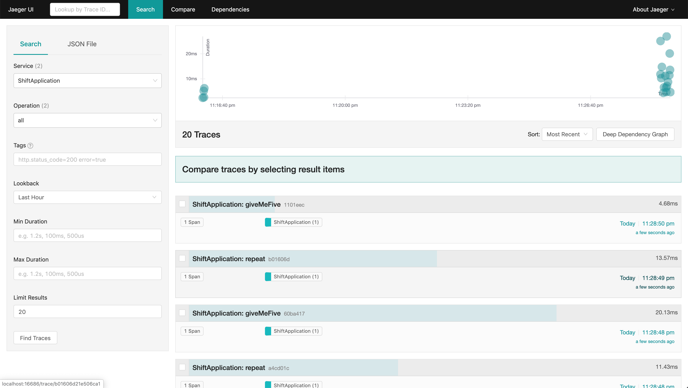
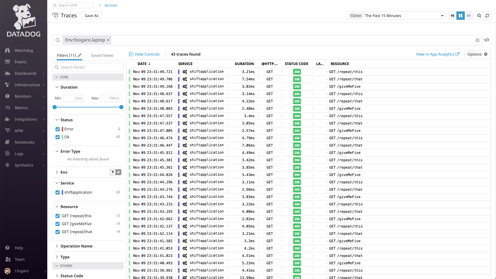
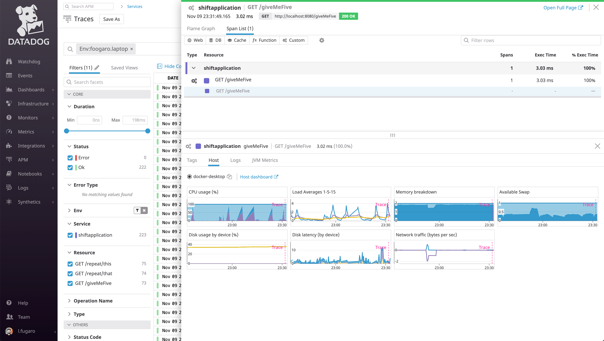

# Shift Tracer

## Core
Simple Java class to switch between different ```io.opentracing.Tracer``` implementation.

It's meant to work in Kubernetes environment (also OpenShift), to switch between different tracers implementation at deployment time.

This can be achieved by setting the parameter ```TRACER_NAME``` to the preferred implementation:
* Jaeger
* Datadog

## App
Simple Spring Boot Application exposing two REST endpoints for the purpose of generating traces:
* http://localhost:8080/giveMeFive
* http://localhost:8080/reapet/this

### Build
The Shift Tracer can be built using Maven or Docker. 

#### Maven
Building with Maven is only needed to push to your private repository and have the other application define a dependencies to the ```com.datadog.opentracing:core``` module.

To build the module, do sa follows:

```bash
mvn -e clean install
```

#### Docker
Building with Maven is only needed to push to your private repository and have the other application define a dependencies to the ```com.datadog.opentracing:core``` module.

To build the module, do sa follows:

```bash
docker build -t shift-tracer:latest .
```

### Testing
To test the Shift Tracer, use the ```docker-compose``` command, as follows:

```docker-compose up```

This will rely on the ```docker-compose.yaml``` file provided with the code.
It will run the following containers:
* Jaeger Agent
* Jaeger Collector
* Jaeger Query
* Cassandra
* Datadog Agent
* Shift Application
 
Once all containers are running, the traces can be generate using the ```curl``` command, as follows:
```bash
curl -vk http://localhost:8080/giveMeFive
curl -vk http://localhost:8080/reapet/this
```

#### Jaeger UI



#### Datadog APM Traces






## Pros
Developers just need to add the OpenTracing and ShiftTracer dependencies to their code, and decide at deployment which tracer implementation to set.

The dependencies:
```xml
<!-- OpenTracing API -->
<dependency>
    <groupId>io.opentracing</groupId>
    <artifactId>opentracing-api</artifactId>
    <version>0.32.0</version>
</dependency>

<!-- Shift Tracer -->
<dependency>
    <groupId>com.datadog.opentracing</groupId>
    <artifactId>core</artifactId>
    <version>0.1.0-SNAPSHOT</version>
    <scope>compile</scope>
</dependency>
```

The environment variable:
```bash
export TRACER_NAME=DATADOG
```

If the environment variable has not a valid value (JAEGER or DATADOG), it will use the Jaeger Traer.

A common use case would be:
* Jaeger for dev and test
* Datadog for pre-prod and prod

No build required for the application, just redeploy.
